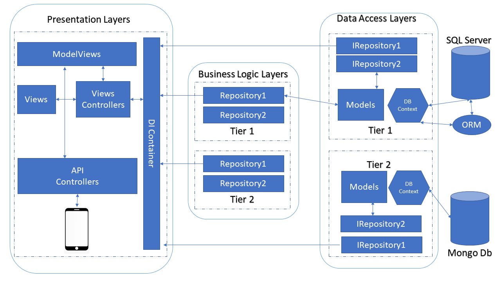

# MarketIO.MVC
An Eshop website written in .Net Core MVC

## This is for Carreer Resume
- How To Buld new Ecommerce website  using N-Tier Architecture and technolgy of Dotnet Core (MVC,API)

## Continuous Integration & Continuous Testing
|Type|Place|Badge|
|:-|:-|:-|
| Build On Ubunto Status|Github| |
|Build and Test Circle CI Pieplines| CircleCI||

## N-Tier Architecture 

## Features 
- Admin Management Dashboard in {Domain/Admin}
- Moderator Management Dashboard in {Domain/Moderator}
- API for accessing Eshop in {Domain/api}

## Setup 
- download the .Net Core SDK and Runtime
- The DB is configured to be the Visual studio Local DB
- Update migrations to accept the DB 

## Dependencies
- EntityFramework Core 
- IdentiryFramework
- AutoMapper
- NLog

